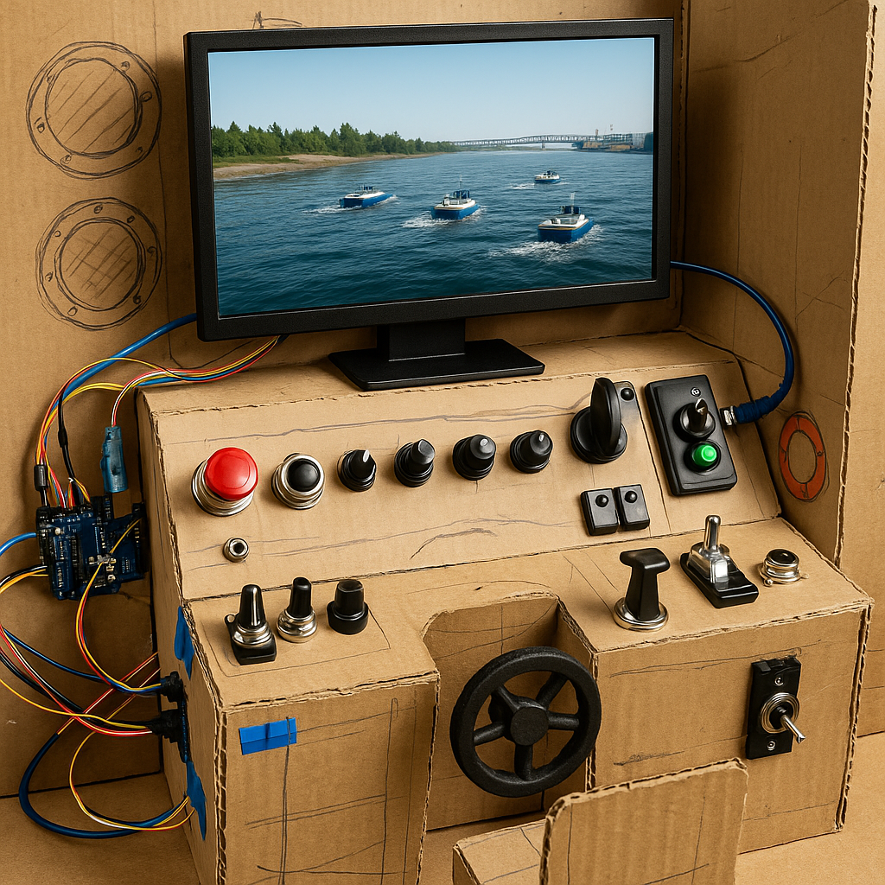

   <b>🚀 Spots Still Available!</b>
  We’re excited to welcome more DIS researchers & practitioners.  
  👉 <a href="https://docs.google.com/forms/d/e/1FAIpQLSfBshh-94YoQmFnASepgmsYfz5d4ntSBTZH7LuVcR4dz_7foQ/viewform?usp=header"> Apply now</a> and join the conversation on the fundamental challenges of interaction design in the age of automation!

*What DALL·E imagines the workshop will look like.*

## 👉 [Click here to apply via our form](https://docs.google.com/forms/d/e/1FAIpQLSfBshh-94YoQmFnASepgmsYfz5d4ntSBTZH7LuVcR4dz_7foQ/viewform?usp=header)

Join us for a workshop that tackles interaction design for automation by centering on the unique power of physical interfaces to restore human control and agency. Bring your working prototypes or share bold ideas for innovative tangible controls. We’ll dive into in-depth discussions and hands-on explorations of real-world domains that stand to gain from stateful physical controls leveraging our embodied intuition. Contributions are welcome from Haptics, Digital Fabrication, Human–Robot Interaction, Interface Design, Tangible Interaction, Human Factors, Control Theory, and Industrial Automation.

To apply, please fill out our [interest form](https://docs.google.com/forms/d/e/1FAIpQLSfBshh-94YoQmFnASepgmsYfz5d4ntSBTZH7LuVcR4dz_7foQ/viewform?usp=header). You can either respond to a few short questions or upload a short PDF (up to 4 pages in DIS22 pictorial format) describing a prototype, interaction concept, or evaluation scenario. An optional video link can also be included.

Participants will have 5-10 minutes to present their work during the workshop. Submissions will be reviewed for relevance and contribution to the workshop goals.
